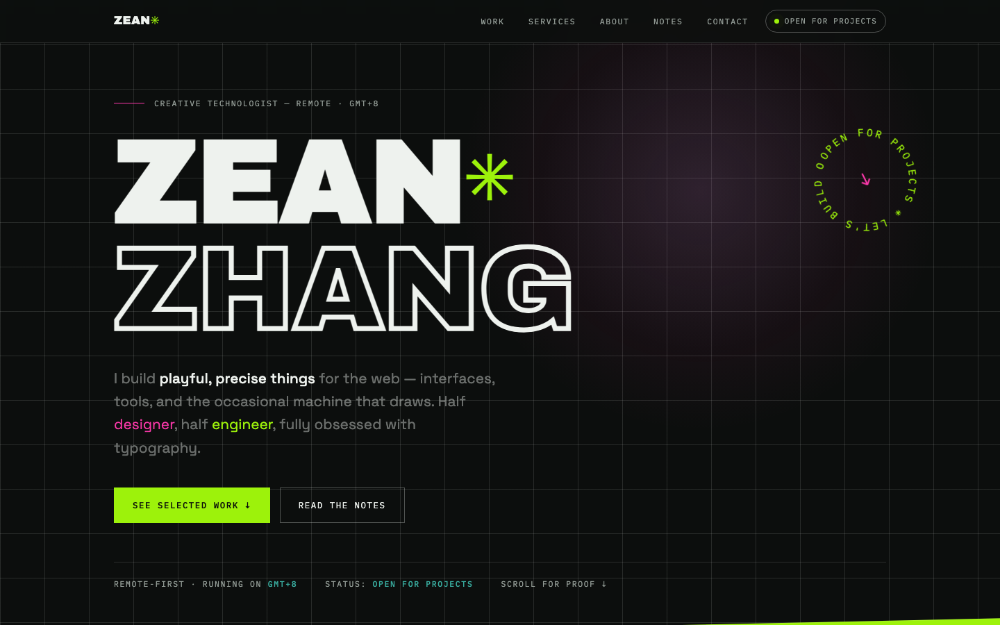
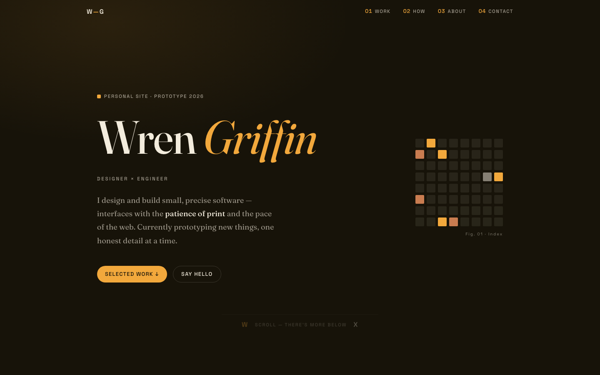

# seeded-design

A Claude skill that designs and builds a landing page or web prototype whose entire visual direction — palette, layout, typography, details — is derived from a random seed generated at run time.

Every run starts from a different 64-character entropy string, so results genuinely diverge instead of converging on the same safe blue-gradient hero.

## How it works

1. **Generate the seed** — real randomness from `/dev/urandom`, never invented by the model.
2. **Read it for a direction** — digit runs, hex-like segments, repeated patterns become concrete decisions: a full palette, a layout structure, a type pairing, and at least one distinctive detail, each traceable to the seed.
3. **Build it well** — a self-contained landing page held to real craft: hierarchy, readability, contrast, responsiveness.
4. **Keep the seed private** — the output shows only the design it inspired.

See [SKILL.md](SKILL.md) for the full instructions.

## Install

Clone into your Claude Code skills directory:

```sh
git clone https://github.com/unintended0x/seeded-design.git ~/.claude/skills/seeded-design
```

## Use

Ask for a page and leave the direction open:

> Build me a landing page — direction is up to you, surprise me.

> 给我做一个落地页，风格你来定，每次都想要不一样的。

## Gallery

Each page below was built by this skill from a different seed — same instructions, completely different directions.

| Neon grid | Warm editorial |
|---|---|
| <br>Dark grid background, solid + outline display type, acid green and magenta accents. | <br>Near-black brown, serif display with an italic accent, ochre highlights. |
